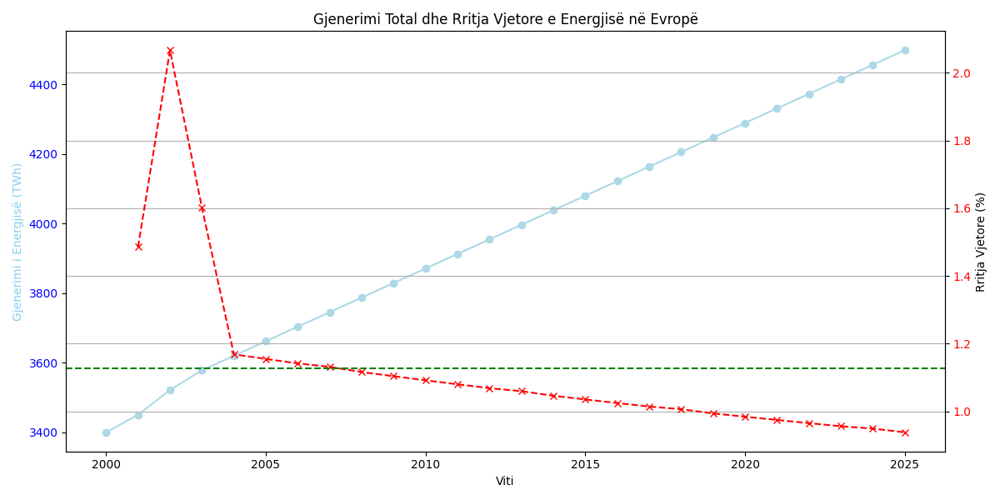
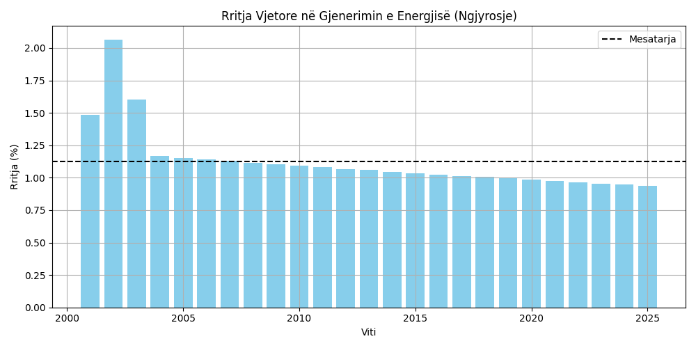
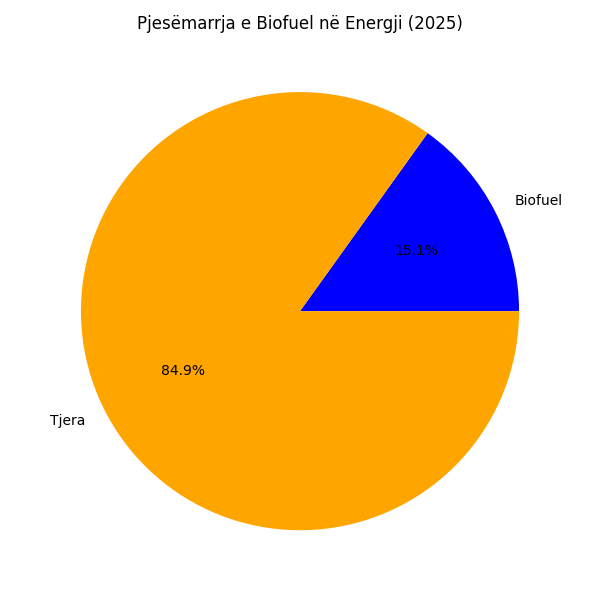
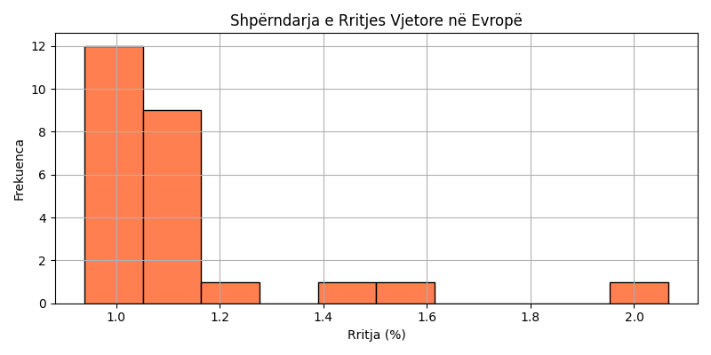

# Analiza e Gjenerimit të Energjisë në Evropë (2000–2025)

Ky projekt analizon të dhënat e prodhimit të energjisë elektrike në Evropë për periudhën 2000 deri 2025, me fokus në rritjen vjetore dhe përdorimin e biokarburanteve.

## Përmbajtja

- **Grafiku 1:** Linjë me dy akse për prodhimin e energjisë dhe rritjen vjetore.  
  

- **Grafiku 2:** Bar chart me ngjyra sipas rritjes vjetore.  
  

- **Grafiku 3:** Pie chart për pjesëmarrjen e biofuel në energji.  
  

- **Grafiku 4:** Bar chart për rritjen mesatare çdo 5 vite.  
  

- **Grafiku 5:** Histogram për shpërndarjen e rritjes.  
  

## File-t kryesore

- `main.py`: Kodi për analizë dhe vizualizim.  
- `data/gjenerimi_energji_europe.csv`: Të dhënat energjetike të Evropës.  
- `requirements.txt`: Libraritë e nevojshme.

## Shënim

Të dhënat janë të bazuara në trende të përafërta për qëllime edukative. Ato tregojnë gjenerimin e energjisë.

---

## 🔍 Analiza dhe Përfundimi

Nga analiza e të dhënave të gjenerimit të energjisë elektrike në Evropë për periudhën 2000–2025, vërehen këto pika kryesore:

1. **Rritje e vazhdueshme në prodhimin e energjisë**  
Gjenerimi total i energjisë është rritur çdo vit, nga 3400 TWh në 2000 në rreth 4500 TWh në 2025.  
Kjo rritje mesatare prej ~1.2% në vit reflekton zhvillim ekonomik dhe nevojë në rritje për energji.

2. **Ndikimi i biokarburanteve**  
Pjesëmarrja e biofuel në energjinë elektrike është rritur nga 5.2% në 2000 në 15.1% në 2025, duke treguar investime në burime të ripërtëritshme.

3. **Stabiliteti dhe rritja graduale**  
Rritja është relativisht e qëndrueshme, duke sugjeruar një strategji afatgjatë pa varësi ekstreme nga tregjet globale.

4. **Trendet afatgjata (çdo 5 vite)**  
Dekadat e fundit kanë pasur rritje më të ngadalësuar krahasuar me fillimin e periudhës, ndoshta për shkak të maturimit të infrastrukturës.

5. **Biofuel si pjesë e tranzicionit të gjelbër**  
Rritja e biofuel tregon fazën e avancuar të tranzicionit drejt burimeve më të pastra.

✅ **Përfundim:**  
Evropa ka pasur një zhvillim të qëndrueshëm me orientim drejt dekarbonizimit dhe objektiva klimatike deri 2050.

---

## 🧾 Si të eksploroni projektin

- **Analiza Python:** Ekzekutoni skriptat për grafikët dhe llogaritjet.  
- **Dashboard Power BI:** Vizualizoni të dhënat në mënyrë interaktive me filtra sipas viteve dhe burimeve.

---

*Faleminderit për vizitën në projektin tim!*  

